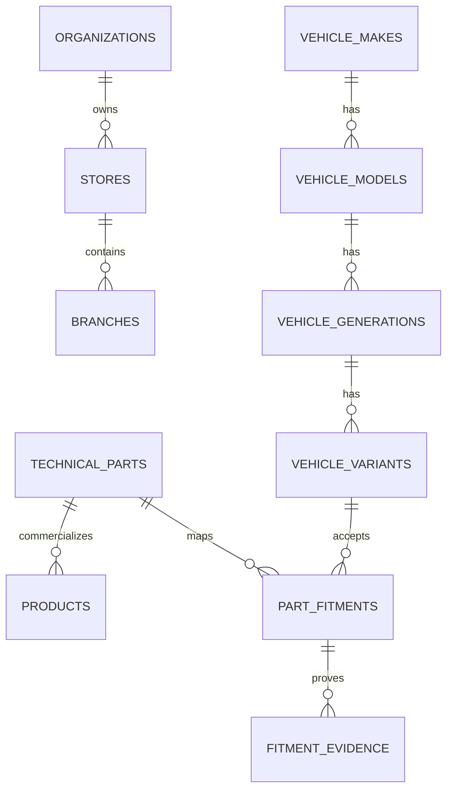

# ERD اولیه

```mermaid
erDiagram
 ORGANIZATIONS ||--o{ STORES : owns
 STORES ||--o{ BRANCHES : contains
 VEHICLE_MAKES ||--o{ VEHICLE_MODELS : has
 VEHICLE_MODELS ||--o{ VEHICLE_GENERATIONS : has
 VEHICLE_GENERATIONS ||--o{ VEHICLE_VARIANTS : has
 TECHNICAL_PARTS ||--o{ PRODUCTS : commercializes
 TECHNICAL_PARTS ||--o{ PART_FITMENTS : maps
 VEHICLE_VARIANTS ||--o{ PART_FITMENTS : accepts
 PART_FITMENTS ||--o{ FITMENT_EVIDENCE : proves
```

کلیدهای public UUID برای لینک‌های بیرونی و کلید عددی داخلی برای joinهای عملیاتی استفاده می‌شوند.
